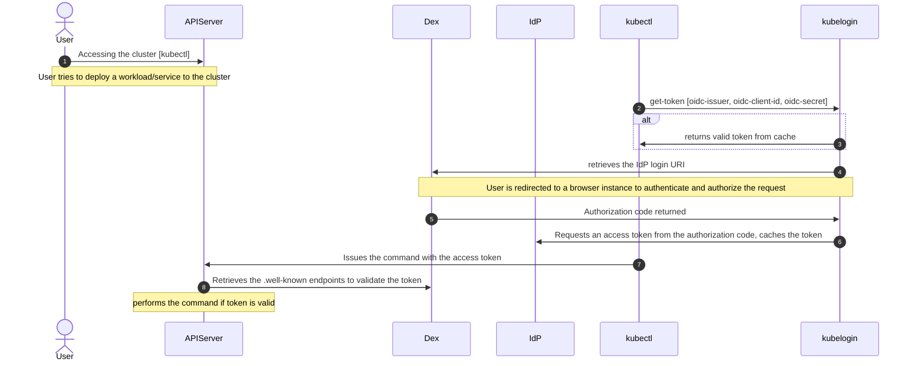

# Local Identity Provider

Start by installing any Kubernetes distribution of your choice. Simply on a VM is to install k3s with default options.

## Install k3s

```bash
curl -sfL https://get.k3s.io | sh -
```

## Install Helm

```bash
curl -fsSL -o get_helm.sh https://raw.githubusercontent.com/helm/helm/main/scripts/get-helm-3
$ chmod 700 get_helm.sh
$ ./get_helm.sh
```

Verify your installation

## Setting up a Local Identity Server

Provide a brief description

There are several choices of identity services that works with Kubernetes with authentication support for existing identiy providers (IdP) such as LDAP, Active Directory. It uses OpenID Connect (OIDC) provider allowing Kubernetes to authenticate users via an external identity source. If the objective here is to provide a bridge between existing IdP to Kubernetes using OIDC Dex is a good choice as it is a very lightweight deployment. More advanced user management, multi-protocol support or invovled RBAC features may require a framework such as `Keycloak`.

Dex provides an OIDS endpoint that Kubernetes query for authentication purposes. The API server interacts with Dex using OIDS configuration (which needs to be provided when the API server starts). Dex does not manage its own user accounts, instead it acts as a bridge between Kubernetes and existings IdPs. It supports severeal protocols such as SAML, LDAP, and OAuth.

## Conceptual Flow



### Installing DEX

Dex can be deployed to Kubernetes using the dex.yml. It needs to be customized with valid clientID and clientSecret along with the callback. 

>Note: If changes to the callback port is desired the port number needs to be modified appropriately.

For testing purposes here we will just create a github OAuth applicaiton. The callback URI registered with the application requires the URI to be resolvable behind a NAT. For local testing purposes we can circumvent the 'outside-in' problem using `ngrok`

### Installing Ngrok

Ngrok provide an API gateway which cloud applications can use to get access to your locally deployed Kubernetes resources via a secure tunnel that is setup between your system and teh Ngrok service. You can create a free account to test out, but this is definitately a simple way to ensure that an external service (such as our test github OAuth application) can reach out and access the cluster for authentication purposes.

```bash
wget https://bin.equinox.io/c/bNyj1mQVY4c/ngrok-v3-stable-linux-amd64.tgz

tar -xvzf ngrok-v3-stable-linux-amd64.tgz

sudo mv ngrok /usr/local/bin/
```

Login to the ngrok webportal and copy your authentication token, then add it to your local ngrok configuraiton

```bash
ngrok config add-authtoken <YOUR-TOKEN>
```

Then start grok and expose the Dex service externally (in this example port 30556 is used).

```bash
ngrok http 30556
```

ngrok will now provide a public forwarding URL that can be used to access localhost on the port specified.

### Configuring github OAuth application

Login to your github account (personal), create a new OAuth application. Configure the Homepage URL and AUthorization callback URL in the following way

`https://<ngrok provided URL>`
`http://<ngrok provided URL>/callback`

Take note of your ClientID and Client Secret, and update the dex.yml file with your ClientID and ClientSecret. Now deploy dex in the local cluster.

```bash
kubectl apply -f dex.yml
```

### Setting up ClusterRole

Configuring a cluster role is necessary to enable authorization of requests using the token acquired from dex, it can be checked against `sub` or `email` or `verified_email` for example. The `dex-role` contains an example to setup a `k3s-dex-user` with oidc.

The ~/.kube/config file needs to be modified to not use the default self-signed certificate for accessing the API server, a new context can be created, or the default be replaced. The context can then be changed to use oidc by running `kubectl config use-context k3s-dex-user`. All `kubectl` commands will now be going through kubelogin which is launched to either retrieve a cached token or get a new token from the IdP.